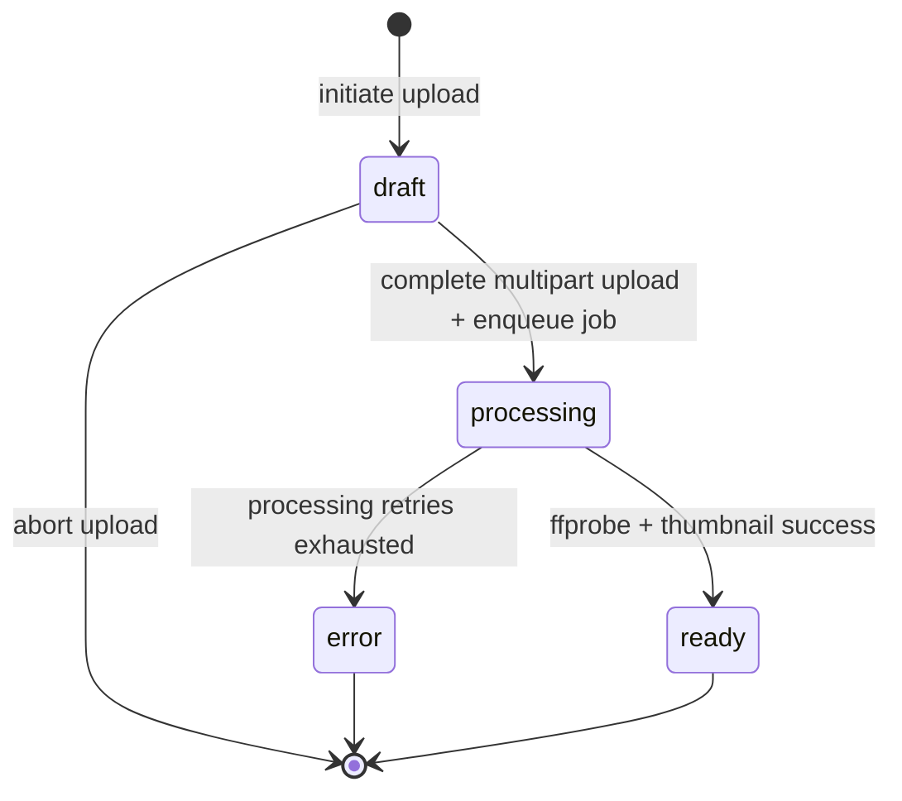

# Phase 03 - Upload e Processamento de Videos

## Objective

Deliver the backend video upload and processing foundation: users can create a draft upload, send up to 10GB directly to S3-compatible object storage through presigned multipart URLs, complete the upload, trigger a real background worker, extract metadata with ffprobe, generate a thumbnail with FFmpeg, receive a unique public URL, stream the ready video with HTTP Range support, and download the file.

---

## Step Implementations

### SI-03.1 - Dependencies, Configuration Namespaces, and Docker Compose Services

**Description:** Install Phase 03 dependencies, add storage/queue/video config namespaces, validate env vars with Joi, and extend Docker Compose with Redis, MinIO, bucket bootstrap, and a dedicated `video-worker` service.

**Technical actions:**

- Install production dependencies in `nestjs-project`: `@aws-sdk/client-s3@^3.1079.0`, `@aws-sdk/s3-request-presigner@^3.1079.0`, `@nestjs/bullmq@^11.0.4`, `bullmq@^5.79.2`.
- Create `src/config/storage.config.ts` reading `STORAGE_ENDPOINT`, `STORAGE_REGION`, `STORAGE_ACCESS_KEY`, `STORAGE_SECRET_KEY`, `STORAGE_VIDEO_BUCKET`, `STORAGE_THUMBNAIL_BUCKET`, `STORAGE_FORCE_PATH_STYLE`, `STORAGE_PRESIGNED_URL_TTL_SECONDS`.
- Create `src/config/queue.config.ts` reading `QUEUE_REDIS_HOST`, `QUEUE_REDIS_PORT`, `QUEUE_DEFAULT_ATTEMPTS`, `QUEUE_BACKOFF_DELAY_MS`.
- Create `src/config/video.config.ts` reading `VIDEO_MAX_UPLOAD_BYTES` (default 10737418240), `VIDEO_MULTIPART_PART_SIZE_BYTES` (default 104857600), `VIDEO_ALLOWED_MIME_TYPES`, `VIDEO_PROCESSING_TIMEOUT_MS`.
- Update `src/config/env.validation.ts`, `.env.example`, and local development docs with Docker Compose service names: `redis`, `minio`, `db`, `mailpit`.
- Update `nestjs-project/compose.yaml` with `redis`, `minio`, `minio-init`, and `video-worker`. The worker uses the same app image but starts `npm run start:worker:dev` or the production worker command.
- Update Dockerfile/build scripts to install `ffmpeg` in the image used by the worker.

**Tests:**

| File | Layer | Verifies |
|------|-------|----------|
| `src/config/storage.config.spec.ts` | Unit | Defaults, numeric coercion, bucket names, path-style flag |
| `src/config/queue.config.spec.ts` | Unit | Redis host/port and retry defaults |
| `src/config/video.config.spec.ts` | Unit | 10GB default limit, part-size validation, allowed MIME parsing |

**Dependencies:** None

**Acceptance criteria:**

- App config boots with all Phase 03 env vars.
- Missing required storage credentials fail fast through Joi.
- Docker Compose has real `redis`, `minio`, and `video-worker` services.
- No container env points at `localhost` for another Compose service.

---

### SI-03.2 - Video Entity, Migration, and Module Skeleton

**Description:** Add the `Video` domain model, lifecycle enum, reversible migration, and `VideosModule` with TypeORM repository wiring.

**Technical actions:**

- Create `src/videos/entities/video.entity.ts` with explicit table name `videos`, explicit column types, timestamps, and relation to `Channel`.
- Create `VideoStatus` enum: `draft`, `processing`, `ready`, `error`.
- Add indexes/constraints: unique `public_id`, index `channel_id`, index `status`, index `original_file_key`.
- Generate/review migration `src/database/migrations/*CreateVideos.ts` with a complete `down()` method.
- Create `src/videos/videos.module.ts` importing `TypeOrmModule.forFeature([Video])` and the existing `ChannelsModule` only as needed for ownership checks.

**Tests:**

| File | Layer | Verifies |
|------|-------|----------|
| `src/videos/entities/video.entity.integration-spec.ts` | Integration | Defaults, unique `public_id`, FK to channel, nullable processing fields, timestamps |
| `src/videos/videos.module.spec.ts` | Unit | Module compiles with TypeORM feature wiring |

**Dependencies:** SI-03.1

**Acceptance criteria:**

- `npm run migration:run` creates `videos` with all columns, constraints, and indexes.
- A new video defaults to `draft`.
- Duplicate `public_id` is rejected by the database.

---

### SI-03.3 - S3 Storage Adapter and Multipart Upload Service

**Description:** Implement a storage adapter that hides AWS SDK/MinIO details and a multipart upload service that calculates parts, signs upload URLs, completes uploads, aborts uploads, and exposes stream/head operations.

**Technical actions:**

- Create `src/videos/storage/video-storage.module.ts`, `video-storage.service.ts`, and a typed `S3_CLIENT` provider.
- Implement key builders for original videos and thumbnails under deterministic prefixes:
  - `channels/{channelId}/videos/{videoId}/original/{safeFileName}`
  - `channels/{channelId}/videos/{videoId}/thumbnails/default.jpg`
- Implement `createMultipartUpload`, `createPresignedUploadPartUrls`, `completeMultipartUpload`, `abortMultipartUpload`, `headObject`, `getObjectStream`, and `putThumbnail`.
- Validate upload size, MIME type, part numbers, ETags, and state transitions before calling storage.
- Keep storage SDK calls out of controllers.

**Tests:**

| File | Layer | Verifies |
|------|-------|----------|
| `src/videos/storage/video-storage.service.spec.ts` | Unit | Key generation, part-size math, command construction, invalid part rejection |
| `src/videos/storage/video-storage.service.integration-spec.ts` | Integration | MinIO multipart create/sign/complete/abort and object head/read where Docker services are available |

**Dependencies:** SI-03.1, SI-03.2

**Acceptance criteria:**

- 10GB upload plans produce a valid part count using 100MiB default parts.
- Generated presigned URLs are scoped to the correct bucket/key/part number.
- Completing multipart upload requires sorted valid ETags and persists no large bytes in the API process.

---

### SI-03.4 - Upload Initiation, Part Signing, Completion, Abort, and Queue Publication API

**Description:** Add authenticated upload endpoints that pre-register draft videos, issue presigned part URLs, complete uploads, move videos to `processing`, and publish a BullMQ job.

**Technical actions:**

- Create DTOs under `src/videos/dto/`: `initiate-video-upload.dto.ts`, `request-upload-parts.dto.ts`, `complete-video-upload.dto.ts`.
- Create response DTOs for upload initiation, part URLs, completion, and status.
- Create `VideosService` methods:
  - `initiateUpload(userId, dto)`
  - `createUploadPartUrls(userId, videoId, dto)`
  - `completeUpload(userId, videoId, dto)`
  - `abortUpload(userId, videoId)`
  - `getOwnerStatus(userId, videoId)`
- Create `VideoProcessingQueueService` producer using BullMQ. Job id is `process-video-{videoId}` for idempotency; BullMQ v5 rejects `:` in custom job ids.
- Ensure completion either publishes the queue job and returns `processing`, or marks the video `error` with `VIDEO_QUEUE_FAILED` if queue publication cannot be completed.
- Create `VideosController` routes under `/videos`.

**Tests:**

| File | Layer | Verifies |
|------|-------|----------|
| `src/videos/videos.service.spec.ts` | Unit | Draft creation, ownership checks, public id retry, upload state transitions, queue failure handling |
| `src/videos/video-processing-queue.service.spec.ts` | Unit | Job name, payload, job id, retry/backoff options |
| `src/videos/videos.service.integration-spec.ts` | Integration | DB persistence, owner-only access, completion status update |
| `test/videos-upload.e2e-spec.ts` | E2E | Authenticated upload initiation, part signing, completion, abort, owner status, error envelope |

**Dependencies:** SI-03.2, SI-03.3

**Acceptance criteria:**

- `POST /videos/uploads` creates a `draft` row before any file bytes are uploaded.
- API never receives the file body.
- `POST /videos/uploads/:videoId/complete` sets status to `processing` and enqueues exactly one processing job.
- Non-owners receive `403 VIDEO_FORBIDDEN`; unauthenticated users receive the inherited auth error.

---

### SI-03.5 - Dedicated Worker and Video Processing Pipeline

**Description:** Add the worker bootstrap and processor that consumes `process-video` jobs, downloads/reads the uploaded object, extracts metadata, generates a thumbnail, uploads the thumbnail, and updates the video lifecycle.

**Technical actions:**

- Create `src/worker.ts` and `src/videos/worker/video-worker.module.ts`.
- Create `VideoProcessingProcessor` registered only in the worker module.
- Create `VideoMediaProbeService` wrapping `ffprobe` and `VideoThumbnailService` wrapping `ffmpeg`.
- Use temporary files under the OS temp directory; cleanup in `finally`.
- On success, persist `duration_seconds`, `metadata`, `thumbnail_key`, `processed_at`, and `status = ready`.
- On failure after all retries, persist `status = error`, `processing_error_code`, `processing_error_message`, and `processing_error_details`.

**Tests:**

| File | Layer | Verifies |
|------|-------|----------|
| `src/videos/worker/video-processing.processor.spec.ts` | Unit | Ready transition, error transition, idempotent skip when already ready |
| `src/videos/worker/video-media-probe.service.spec.ts` | Unit | ffprobe JSON parsing and failure mapping |
| `src/videos/worker/video-thumbnail.service.spec.ts` | Unit | ffmpeg command construction, timeout/error handling |
| `src/videos/worker/video-processing.processor.integration-spec.ts` | Integration | End-to-end processing of a tiny fixture video when Docker storage/Redis are available |

**Dependencies:** SI-03.3, SI-03.4

**Acceptance criteria:**

- API process does not register a queue processor.
- Worker process can consume a job from Redis and update the video row.
- A successful job results in `ready` with duration metadata and thumbnail key.
- A failed job results in `error` with persisted diagnostic fields.

---

### SI-03.6 - Public Metadata and Owner Status API

**Description:** Expose safe metadata for ready public videos and owner-only status/error details for drafts, processing, and failed uploads.

**Technical actions:**

- Add `GET /videos/:publicId` for anonymous/public ready video metadata.
- Add `GET /videos/uploads/:videoId/status` for authenticated owners.
- Ensure `ready` is required for public metadata; non-ready public access returns `404 VIDEO_NOT_FOUND` to avoid leaking private drafts.
- Shape responses through DTOs; do not expose storage keys on public endpoints.

**Tests:**

| File | Layer | Verifies |
|------|-------|----------|
| `src/videos/videos.service.spec.ts` | Unit | Public ready lookup, non-ready hiding, owner status detail |
| `test/videos-metadata.e2e-spec.ts` | E2E | Public ready response, non-ready 404, owner status includes error fields |

**Dependencies:** SI-03.4, SI-03.5

**Acceptance criteria:**

- Anonymous users can read metadata for `ready` videos by `publicId`.
- Anonymous users cannot discover draft/processing/error videos.
- Owners can inspect upload/processing status and failure details.

---

### SI-03.7 - Streaming Endpoint with HTTP Range Support

**Description:** Implement video playback streaming through the API using S3 Range reads and HTTP `206 Partial Content` responses.

**Technical actions:**

- Create a range parser utility supporting single `bytes=start-end`, `bytes=start-`, and `bytes=-suffixLength` ranges.
- Add `GET /videos/:publicId/stream`.
- Use `HeadObject` to determine size/content type before responding.
- Use `GetObject` with `Range` for partial content and stream without buffering the entire object.
- Return `416 VIDEO_RANGE_NOT_SATISFIABLE` for invalid/unsatisfiable ranges.

**Tests:**

| File | Layer | Verifies |
|------|-------|----------|
| `src/videos/range.util.spec.ts` | Unit | Valid ranges, suffix ranges, open-ended ranges, invalid/multi-range rejection |
| `src/videos/videos-streaming.service.spec.ts` | Unit | Header calculation, S3 Range request construction, 416 behavior |
| `test/videos-streaming.e2e-spec.ts` | E2E | `206`, `Content-Range`, `Accept-Ranges`, no full-file body for range requests |

**Dependencies:** SI-03.3, SI-03.6

**Acceptance criteria:**

- Browser-style Range requests return `206 Partial Content`.
- Invalid ranges return `416` with `Content-Range: bytes */<size>`.
- Endpoint never reads the full 10GB object into memory.

---

### SI-03.8 - Download Endpoint, OpenAPI, Documentation, and Final Quality Gate

**Description:** Add full download support, enrich OpenAPI docs, update AI/project foundation docs to reflect the real Phase 03 state, and run all required verification commands.

**Technical actions:**

- Add `GET /videos/:publicId/download` returning the full object stream with attachment disposition.
- Annotate video endpoints and DTOs with `@nestjs/swagger` decorators consistent with the OpenAPI TD.
- Regenerate `nestjs-project/openapi.json`.
- Update `CLAUDE.md` or equivalent project guidance with Phase 03 services, env vars, worker command, and Docker service names.
- Update `docs/phases/phase-03-videos/progress.md` after each SI.
- Run relevant tests after each SI, then full project gates before finishing.

**Tests:**

| File | Layer | Verifies |
|------|-------|----------|
| `test/videos-download.e2e-spec.ts` | E2E | Ready video download headers and object stream |
| `openapi:export` command | Contract | Video endpoints appear in `openapi.json` with request/response/error schemas |
| Full commands | Quality gate | Unit/integration/e2e, TypeScript compile, lint |

**Dependencies:** SI-03.6, SI-03.7

**Acceptance criteria:**

- Download works for ready videos and returns attachment headers.
- OpenAPI artifact reflects all video endpoints.
- Project docs match the actual implementation and Docker service names.
- Required quality commands pass or any environment blocker is recorded with exact command/output.

---

## Technical Specifications

### Data Model

`videos` table:

| Column | Type | Required | Notes |
|--------|------|----------|-------|
| `id` | uuid PK | yes | Generated UUID |
| `channel_id` | uuid FK | yes | Owner channel; FK to `channels.id` |
| `title` | varchar(120) | yes | Initial display title |
| `public_id` | varchar(32), unique | yes | URL-safe random id from Node `crypto` |
| `status` | enum | yes | `draft`, `processing`, `ready`, `error`; default `draft` |
| `original_file_name` | varchar(255) | yes | Client file name, sanitized for headers/keys |
| `mime_type` | varchar(100) | yes | Must be in allowed video MIME list |
| `size_bytes` | bigint | yes | Max 10GB; TypeORM transformer returns number |
| `original_file_key` | varchar(1024) | yes | S3 key for original video |
| `thumbnail_key` | varchar(1024) | no | S3 key for generated thumbnail |
| `upload_id` | varchar(512) | no | S3 multipart upload id while `draft` |
| `part_size_bytes` | integer | yes | Default 104857600 |
| `part_count` | integer | yes | Calculated from size/part size |
| `duration_seconds` | integer | no | Rounded from ffprobe duration |
| `metadata` | jsonb | no | ffprobe format/stream metadata subset |
| `processing_job_id` | varchar(128) | no | BullMQ job id |
| `processing_error_code` | varchar(80) | no | Machine-readable failure code |
| `processing_error_message` | text | no | Short user/developer-readable failure |
| `processing_error_details` | jsonb | no | Structured diagnostic details |
| `upload_completed_at` | timestamptz | no | Set after multipart completion |
| `processed_at` | timestamptz | no | Set after successful processing |
| `created_at` | timestamptz | yes | CreateDateColumn |
| `updated_at` | timestamptz | yes | UpdateDateColumn |

### API Contracts

| Method | Path | Auth | Request | Success |
|--------|------|------|---------|---------|
| `POST` | `/videos/uploads` | required | `{ title, originalFileName, mimeType, sizeBytes }` | `201 { videoId, publicId, status, uploadId, partSizeBytes, partCount }` |
| `POST` | `/videos/uploads/:videoId/parts` | owner | `{ partNumbers: number[] }` | `200 { parts: [{ partNumber, uploadUrl, expiresAt }] }` |
| `POST` | `/videos/uploads/:videoId/complete` | owner | `{ parts: [{ partNumber, eTag }] }` | `200 { videoId, publicId, status: "processing" }` |
| `DELETE` | `/videos/uploads/:videoId` | owner | none | `204` |
| `GET` | `/videos/uploads/:videoId/status` | owner | none | `200 { videoId, publicId, status, processingError?, durationSeconds?, thumbnailUrl? }` |
| `GET` | `/videos/:publicId` | public | none | `200 { publicId, title, durationSeconds, thumbnailUrl, status: "ready" }` |
| `GET` | `/videos/:publicId/thumbnail` | public ready | none | `200` JPEG thumbnail stream |
| `GET` | `/videos/:publicId/stream` | public ready | `Range` optional | `206` for range, `200` full stream |
| `GET` | `/videos/:publicId/download` | public ready | none | `200` attachment stream |

### Authorization Matrix

| Operation | Anonymous | Authenticated non-owner | Owner |
|-----------|-----------|--------------------------|-------|
| Initiate upload | 401 | n/a | allowed |
| Sign upload parts | 401 | 403 `VIDEO_FORBIDDEN` | allowed while `draft` |
| Complete upload | 401 | 403 `VIDEO_FORBIDDEN` | allowed while `draft` |
| Abort upload | 401 | 403 `VIDEO_FORBIDDEN` | allowed while `draft` |
| Owner status | 401 | 403 `VIDEO_FORBIDDEN` | allowed |
| Public metadata | allowed only when `ready` | same as anonymous | same as anonymous unless using owner status |
| Thumbnail | allowed only when `ready` and thumbnail exists | allowed only when `ready` and thumbnail exists | allowed only when `ready` and thumbnail exists |
| Stream | allowed only when `ready` | allowed only when `ready` | allowed only when `ready` |
| Download | allowed only when `ready` | allowed only when `ready` | allowed only when `ready` |

### Error Catalog

All domain errors use the inherited envelope `{ statusCode, error, message }`.

| Error | HTTP | Trigger |
|-------|------|---------|
| `VIDEO_NOT_FOUND` | 404 | Missing video or non-ready video requested through public route |
| `VIDEO_FORBIDDEN` | 403 | Authenticated user does not own upload/status resource |
| `VIDEO_NOT_READY` | 409 | Stream/download requested for a non-ready video through an owner-only flow |
| `VIDEO_INVALID_UPLOAD_STATE` | 409 | Part signing/completion/abort attempted outside `draft` |
| `VIDEO_UPLOAD_TOO_LARGE` | 413 | `sizeBytes` exceeds 10GB |
| `VIDEO_UNSUPPORTED_TYPE` | 415 | MIME type not in configured video allowlist |
| `VIDEO_INVALID_PARTS` | 400 | Invalid part numbers, duplicate parts, missing ETags, or part count mismatch |
| `VIDEO_STORAGE_FAILED` | 502 | S3/MinIO operation fails |
| `VIDEO_QUEUE_FAILED` | 502 | Queue publication fails after upload completion |
| `VIDEO_PROCESSING_FAILED` | persisted | Worker failure stored on video row; owner status exposes it |
| `VIDEO_RANGE_NOT_SATISFIABLE` | 416 | Invalid, unsupported, or unsatisfiable byte range |

### Events / Messages

| Queue | Job | Producer | Consumer | Payload | Options |
|-------|-----|----------|----------|---------|---------|
| `video-processing` | `process-video` | API `VideosService.completeUpload` | `video-worker` `VideoProcessingProcessor` | `{ videoId, channelId, originalFileKey }` | `jobId=process-video-{videoId}`, attempts from config, exponential backoff |

Processing state transitions:

### Dependency Map

| SI | Depends on | Unlocks |
|----|------------|---------|
| SI-03.1 | none | All Phase 03 implementation |
| SI-03.2 | SI-03.1 | Storage/upload services, worker persistence |
| SI-03.3 | SI-03.1, SI-03.2 | Upload API, streaming, worker thumbnail upload |
| SI-03.4 | SI-03.2, SI-03.3 | Worker jobs, owner upload status |
| SI-03.5 | SI-03.3, SI-03.4 | Ready/error status, public metadata |
| SI-03.6 | SI-03.4, SI-03.5 | Streaming and download readiness checks |
| SI-03.7 | SI-03.3, SI-03.6 | Browser playback |
| SI-03.8 | SI-03.6, SI-03.7 | Final deliverable and quality gate |

### Deliverables and Verification

- `docs/decisions/technical-decisions-phase-03-videos.md`
- `docs/phases/phase-03-videos/context.md`
- `docs/phases/phase-03-videos/validation.md`
- `docs/phases/phase-03-videos/library-refs.md`
- `docs/phases/phase-03-videos/phase-03-videos.md`
- `docs/phases/phase-03-videos/progress.md`
- `nestjs-project/src/videos/**`
- `nestjs-project/src/worker.ts`
- `nestjs-project/src/database/migrations/*CreateVideos.ts`
- `nestjs-project/compose.yaml` with Redis, MinIO, and `video-worker`
- Updated `nestjs-project/openapi.json`
- Updated project AI/developer guidance (`CLAUDE.md` or equivalent)
- Verification commands:
  - During development: targeted tests for each SI.
  - Before finishing: `npm test -- --runInBand`, `npm run test:integration`, `npm run test:e2e`, `npx tsc --noEmit`, `npm run lint`.
